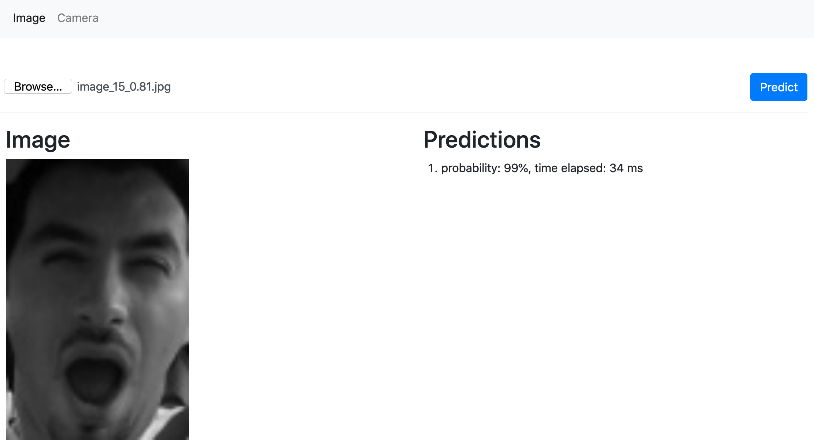

# Web demo for Yawn detection

Demo is available at https://igla.su/mouth-open-js/

<a href='https://igla.su/mouth-open-js/'></a><br/>


## Install

Configure project:
```bash
npm init
```

Install [nodemon](https://github.com/remy/nodemon) to monitor changes automatically:
```bash
npm install -g nodemon
```

Install [`express`](https://github.com/expressjs/express) web application framework:
```bash
npm install express
```


Finally, start application via:
```bash
nodemon index.js 
```


## Issues

If you find any problems or would like to suggest a feature, please
feel free to file an [issue](https://github.com/iglaweb/mouth-open-js/issues)

## License

    Copyright 2021 Igor Lashkov

    Licensed under the Apache License, Version 2.0 (the "License");
    you may not use this file except in compliance with the License.
    You may obtain a copy of the License at

       http://www.apache.org/licenses/LICENSE-2.0

    Unless required by applicable law or agreed to in writing, software
    distributed under the License is distributed on an "AS IS" BASIS,
    WITHOUT WARRANTIES OR CONDITIONS OF ANY KIND, either express or implied.
    See the License for the specific language governing permissions and
    limitations under the License.